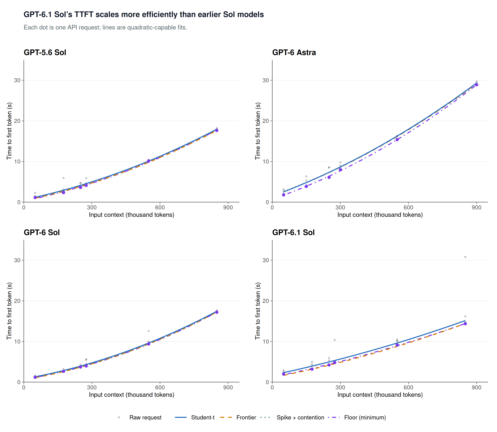

# GPT-6 Sol and GPT-6.1 Sol API comparison supplement

This separate supplement adds October 6, 2026 direct OpenAI API measurements and
the four-panel comparison below. It does not replace, refit, or pool observations
into the original headline results or Figures 1–4. No subscription measurements,
account state, private website code, logo, or branded website assets are included.



[SVG](../figures/sol-api/four_model_api_robustness_with_minimum_floor_2x2_titled.svg) ·
[PDF](../figures/sol-api/four_model_api_robustness_with_minimum_floor_2x2_titled.pdf)

The title describes fitted point estimates, not a calibrated test of the difference
between models. Sessions were collected on different dates and were not paired.
All observations, including the slow GPT-6.1 Sol requests, remain visible.
The curves are zero-block-effect baselines, not predictions for a particular block.
All models use the same quadratic-capable estimator families. Different deployment
load, routing, and generation settings preclude conclusions about model size,
architecture, popularity, or isolated accelerator runtime.

## Figure data and provenance

| Model/panel | Date | Measurements / complete blocks | Source already present or added |
|---|---|---:|---|
| GPT-5.6 Sol, upper left | 2026-08-14 | 30 / 5 | `data/raw/final/20260814T140715Z-bee825d8.jsonl` (existing) |
| GPT-6 Astra, upper right | 2026-09-09 | 24 / 4 | Both existing `data/raw/astra-api/` logs, with session-qualified blocks |
| GPT-6 Sol, lower left | 2026-10-06 | 30 / 5 | `data/raw/sol-api/20261006-sol-shared.jsonl` |
| GPT-6.1 Sol, lower right | 2026-10-06 | 30 / 5 | Same new log, distinct model/session |

All 114 plotted observations are direct OpenAI Responses API requests. All four
models' measured requests have a 2,051-token cache read and zero cache writes;
the long suffix is uncached. Astra spans two cache keys/source sessions, and the
other models each have their own key. Cache reuse does not establish fixed hardware.
GPT-5.6/6 Sol used reasoning `none`; GPT-6.1 Sol and Astra used `low`. All measured
requests reported zero reasoning tokens. The output cap was 32 for the Sol runs
and 512 for Astra (whose observed output was still short). See the original
[Astra methodology](astra-api.md) for its setup and inclusion criteria.

Each Sol session used 50k, 175k, 250k, 275k, 550k and 850k nominal total tokens.
Astra used 50k, 150k, 250k, 300k, 550k and 900k. Sol has five measurements per
length, Astra four. Exact inputs were nominal minus two throughout these sessions.

The original GPT-5.6 fitting code used **nominal** tokens / 1e6; its published
coefficients are reused without alteration. Astra and the new Sol fits use
**reported actual total** tokens / 1e6. All points and the displayed curve grids
use actual totals. The two-token convention difference is retained transparently
rather than changing any old fit; its plotted effect is negligible.

The literal-floor fit is an unweighted OLS quadratic through one minimum TTFT
observation per measured length (first occurrence if tied). It has no block
effects, confidence interval, or theoretical lower-bound interpretation. Minima
depend on repetition count. Its purple markers overlay those same raw observations;
they are not additional requests.

## Reproduce offline

Run from the repository root with the existing R dependencies:

```sh
make sol-api
```

This refits only the two new model sessions, regenerates the 5,000-replicate Huber
and 200-replicate asymmetric whole-block bootstraps, checks historical coefficient
provenance (including a fresh Astra frontier/spike fit), renders the figure, and
validates observation membership. It does not contact providers or load API keys.
For a fast rerender from committed fit tables: `make sol-api-figures`.
The ordinary `make reproduce` remains unchanged and retains the original report scope.

- [Exact collection and analysis methodology](sol-api/collection-methodology.md)
- [Checkpoint decisions, including noise warnings](sol-api/checkpoint-review.md)
- [Numerical results and limitations](sol-api/results.md)
- [Collection source excerpts and portability notes](sol-api/collection-source.md)
- `config/sol-api/*-manifest.json`: exact schedules, prompt cut points, settings,
  prices, source hashes, and review rules recorded before each session.
- `data/raw/sol-api/20261006-sol-shared.jsonl`: 60 measurements, two excluded setup
  calls, pre-request cost reservations, and all checkpoints. No prior pilot
  observations are included. The budget ledger includes its recorded $0.6939188
  cost; new collection cost is $76.1724735, not an account invoice.
- `outputs/sol-api/`: measured observations, linear/quadratic evidence, fit
  coefficients, block effects, fitted objects in readable JSON, bootstrap draws,
  intervals, sigma-anchor sensitivity, and Astra asymmetric verification.
- `outputs/sol-api/comparison/`: all 114 plotted observations, 16 curves' fitted
  coefficients, 4,800 curve-grid rows, and 24 selected minimum points.

Historical fitted coefficients are archived in
`config/sol-api/historical_comparison_coefficients.csv` and validated against
existing released results and the Astra refit. They are not inferred from images.

## Statistical caution

Student-t uses fixed df=4 and unrestricted quadratic curvature. Reported LR
p-values reference asymptotic chi-square(1), conditional on that model; they are
not exact, block-robust, or adjusted for discretionary checkpoint continuation.
The 95% Huber intervals are **not** Student-t intervals. Frontier and spike models
constrain slope and curvature nonnegative and use the negative-residual robust
sigma anchor. Only five independent new blocks are available per model.
Between-model point-estimate differences are not a formal curvature-difference test.

The API collector source hashes identify the historical implementation, not the
public repository's source hash after portability changes. A future paid rerun
must explicitly configure reasoning `low` for 6.1; the original public collector's
default `none` must not be used for that model. No new paid runner is installed by
this data-and-analysis supplement.
